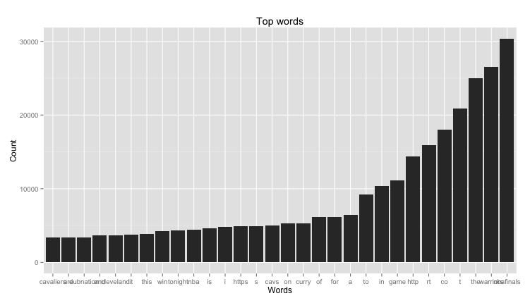
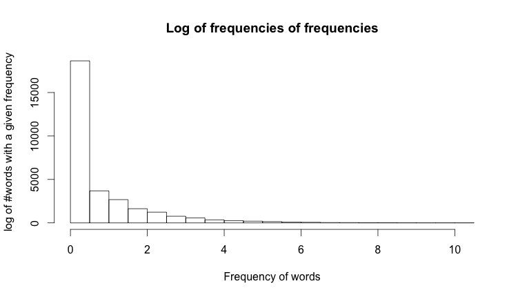

# Assignment 2 #

## Tweets ##
I used the API through Tweepy to get tweets from 2015-06-10 to 2015-06-17. I created 4 files, each one with a list of JSON objects representing tweets

 0. [All the tweets](https://s3-us-west-2.amazonaws.com/assignment2-walter/final_combined)
 1. [#FinalNBA2015](https://s3-us-west-2.amazonaws.com/assignment2-walter/final_nba)
 2. [#FinalNBA2015 and #Warriors](https://s3-us-west-2.amazonaws.com/assignment2-walter/final_nba_and_warriors)
 3. [#Warriors](https://s3-us-west-2.amazonaws.com/assignment2-walter/final_warriors)

## These are some files in this folder ##
 
 1. run.sh: shell program that execute the main python program and will retry automatically if there's an exception.
 2. main.py: program that creates 3 threads, each one querying the API for a different combination of hashtags: #FinalNBA2015 only, #Warriors only, and #FinalNBA2015 and #Warriors. It uses an external file to store the last id that it saw for each thread, so that it can recover its state if there's a failure.
 3. dedup.py: program that dedups tweets. I discovered that the API sometimes returns duplicated tweets so I had to do this.
 4. hist.py: program that reads all the tweets and generates a new sorted file with the counts for each word. It removes non alphabetic characters and lowers all the words.
 5. init.sh: program to execute only once before running run.sh. No need to run, it has already been executed.

## There are three histograms as png ##
 Topwords 30: contains the histogram of the 30 top words
 

 Topwords 100: contains the histogram of the 100 top words
 

 Log of frequencies of counts: contains, for a given number x, the log of how many words appear x times
 

